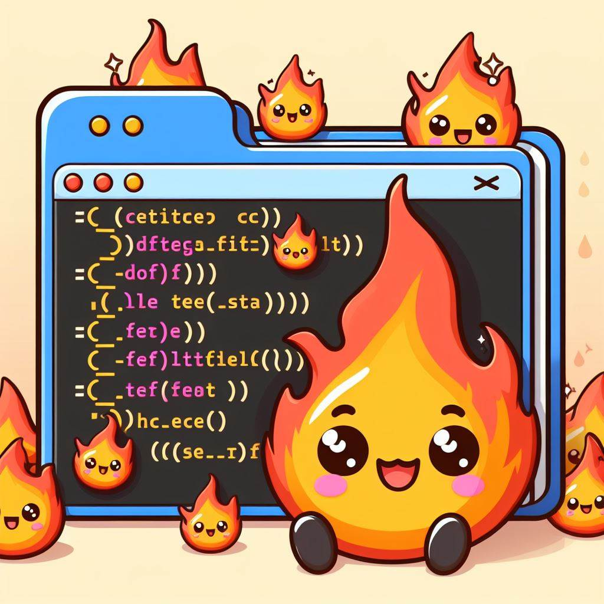

# 

# ## Project Description:
# This project is designed to automate the conversion of Python code to Mojo code. The conversion script will traverse a directory of Python files, refactor the code to align with Mojo syntax, and apply Mojo-specific optimizations. The goal is to facilitate a smooth transition for developers moving from Python to Mojo by providing a tool that handles the bulk of the conversion process.

# ## Vision:
# Our vision is to streamline the development workflow by providing a seamless conversion tool that bridges the gap between Python and Mojo. By automating the refactoring process, we aim to save time and reduce errors, allowing developers to focus on more complex aspects of Mojo development.

# ## Setup and Installation:
# Detailed instructions on how to set up the project, install dependencies, and get the script running.

# ## Usage:
# Step-by-step guide on how to use the script, including command-line arguments and expected outputs.

# ## Contributing:
# Guidelines for contributing to the project, including code style, pull request process, and issue reporting.

# ## License:
# Information about the project's license and usage rights.

# ## Community:
# Invitation to join the project's community for support, discussion, and collaboration. Includes links to communication platforms like Discord.

# [Join the Opensoucerer Discord Community](https://discord.gg/Bk8npKbsB9)
